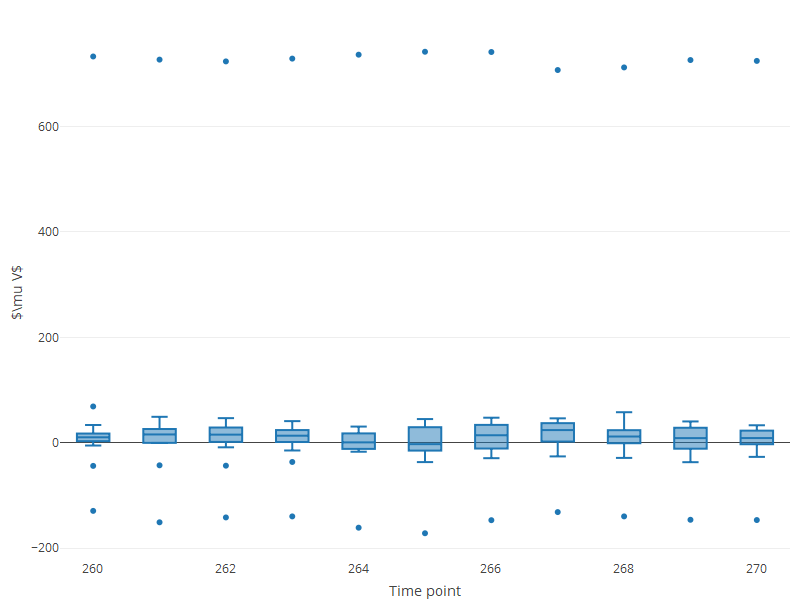

<!-- README.md is generated from README.Rmd. Please edit that file -->

```{r, include = FALSE}
knitr::opts_chunk$set(
  collapse = TRUE,
  comment = "#>",
  fig.path = "man/figures/README-",
  out.width = "100%"
)
```

# diegr

<!-- badges: start -->

<!-- badges: end -->

## Overview

The name diegr comes from **Dynamic and Interactive EEG Graphics using R**. The `diegr` package enables researchers to visualize high-density electroencephalography (HD-EEG) data with animated and interactive graphics, supporting both exploratory and confirmatory analyses of sensor-level brain signals.

The package `diegr` includes:

-   interactive boxplots (`boxplot_epoch`, `boxplot_subject`, `boxplot_rt`)
-   interactive epoch waveforms (`interactive_waveforms`)
-   topographic maps in 2D (`topo_plot`)
-   scalp plots in 3D (`scalp_plot`)
-   functions for computing baseline correction, pointwise and jackknife mean (`baseline_correction`, `compute_mean`)
-   functions for plotting the mean with pointwise confidence interval (`plot_time_mean`, `plot_topo_mean`)
-   animations of time course of the raw signal or the average in 2D and 3D (`animate_topo`, `animate_topo_mean`, `animate_scalp`)

## Installation
You can install the current version of `diegr` from CRAN with:

```{r, eval = FALSE}
install.packages("diegr")
```

or the latest development version from GitHub with:
``` {r, eval = FALSE}
# install.packages("devtools")
devtools::install_github("gerslovaz/diegr") 
```

## Data

Because of large volumes of data obtained from HD-EEG measurements, the package allows users to work directly with database tables (in addition to common formats such as data frames or tibbles). Such a procedure is more efficient in terms of memory usage.

The database you want to use as input to `diegr` functions must contain columns with the following structure::

-   `subject` - ID of subjects,
-   `epoch` - epoch numbers
-   `time` - numbers of time points (as sampling points, not in ms),
-   `sensor` - sensor labels,
-   `signal` - the EEG signal amplitude in microvolts (in some functions it is possible to set the name of the column containing the amplitude arbitrarily).

The package contains some included training datasets:

-   `epochdata`: epoched HD-EEG data (anonymized short slice from big HD-EEG study presented in Madetko-Alster, 2025) arranged as mentioned above,
-   `HCGSN256`: a list with Cartesian coordinates of HD-EEG sensor positions in 3D space on the scalp surface and their projection into 2D space
-   `rtdata`: response times (time between stimulus presentation and pressing the button) from the experiment involving a simple visual motor task (anonymized short slice from big HD-EEG study presented in Madetko-Alster, 2025).

For more information about the structure of built-in data see the package vignette `vignette("diegr", package = "diegr")`.

## Quick examples

#### Interactive boxplot

This is a basic example which shows how to plot interactive epoch boxplots from chosen electrode in different time points for one subject:

```{r library, warning=FALSE}
library(diegr)
data("epochdata")
```

```{r boxplot, eval=FALSE}
boxplot_epoch(epochdata, amplitude = "signal", subject = 1, channel = "E65", time_lim = c(10:20))
```

```{r echo=FALSE}

```

Note: The README format does not allow the inclusion of `plotly` interactive elements, only the static preview of the result is shown.

#### Topographic map

```{r topoplot}
data("HCGSN256")
# creating a mesh
M1 <- point_mesh(dimension = 2, n = 30000, type = "polygon", sensor_select = unique(epochdata$sensor))
# filtering a subset of data to display 
data_short <- epochdata |>
  dplyr::filter(subject == 1 & epoch == 10 & time == 15) 
# function for displaying a topographic map of the chosen signal on the created mesh M1
topo_plot(data_short, amplitude = "signal", mesh = M1)
```

#### Computing and displaying the average

Compute the average signal for subject 2 from the channel E65 (exclude the oulier epochs 14 and 15) and then display it along with CI bounds

```{r timemean}
# extract required data
edata <- epochdata |>
dplyr::filter(subject == 2 & sensor == "E65" & epoch %in% 1:13)
# baseline correction
data_base <- baseline_correction(edata, baseline_range = 1:10)
# compute average
data_mean <- compute_mean(data_base, amplitude = "signal_base", subject = 2,
                          channel = "E65", type = "point")
# plot the average line with CI in blue colors
plot_time_mean(data = data_mean, t0 = 10, color = "blue", fill = "lightblue")
```


For detailed examples and usage explanation, please see the package vignette: `vignette("diegr", package = "diegr")`.

**References**
Madetko-Alster N., Alster P., Lamoš M., Šmahovská L., Boušek T., Rektor I. and Bočková M. The role of the somatosensory cortex in self-paced movement impairment in Parkinson’s disease. *Clinical Neurophysiology.* 2025, vol. 171, 11-17. <https://doi.org/10.1016/j.clinph.2025.01.001>

**License** 
This package is distributed under the MIT license. See LICENSE file for details.

**Citation**
Use `citation("diegr")` to cite this package.


<!-- You'll still need to render `README.Rmd` regularly, to keep `README.md` up-to-date. `devtools::build_readme()` is handy for this. -->

<!-- You can also embed plots, for example: -->

<!-- ```{r pressure, echo = FALSE} -->

<!-- plot(pressure) -->

<!-- ``` -->

<!-- In that case, don't forget to commit and push the resulting figure files, so they display on GitHub and CRAN. -->
