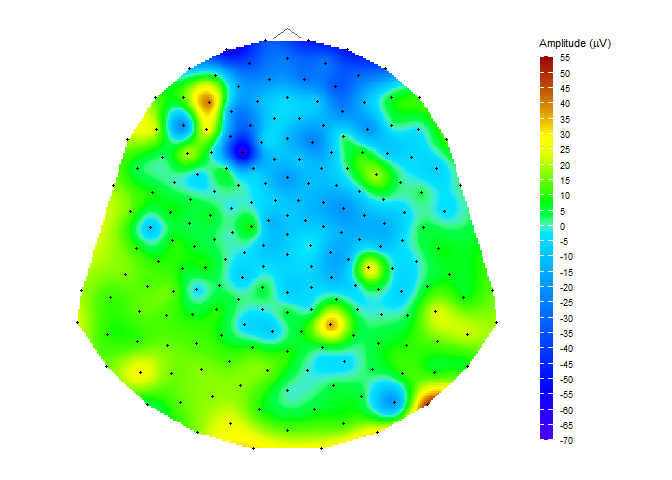

<!-- README.md is generated from README.Rmd. Please edit that file -->

# diegr

<!-- badges: start -->
<!-- badges: end -->

The name diegr comes from **Dynamic and Interactive EEG Graphics using
R**. The package is developed to display high-density
electroencephalography (HD-EEG) data in different ways using interactive
elements or animations for a comprehensive overview of data.

The package diegr includes: \* interactive boxplots \* interactive epoch
waveforms \* topographic maps (2D projection) \* head plots in 3D

## Installation

You can install the development version of diegr from
[GitHub](https://github.com/) with:

``` r
# install.packages("devtools")
devtools::install_github("gerslovaz/diegr")
```

## Example

This is a basic example which shows you how to plot interactive epoch
boxplots from chosen electrode in different time points for one subject:

``` r
library(diegr)
data("epochdata")
```

``` r
boxplot_epoch(epochdata, subject = 1, channel = "E3", time_lim = c(260:270))
```


Note: The README format does not allow the inclusion of plotly
interactive elements, only the static preview of the result is shown.
(here add a link on Github Pages for complete graph)

#### Topographic map

``` r
data("HCGSN256")
# creating a mesh
M1 <- point_mesh(2, type = "polygon")
# filtering a subset of data to display 
signal <- epochdata |>
  dplyr::filter(subject == 1 & epoch == 10 & time == 255) 
signal <- signal$signal
# function for displaying a topographic map of the chosen signal on the created mesh M1
topo_plot(signal, M1)
```



<!-- You'll still need to render `README.Rmd` regularly, to keep `README.md` up-to-date. `devtools::build_readme()` is handy for this. -->
<!-- You can also embed plots, for example: -->
<!-- ```{r pressure, echo = FALSE} -->
<!-- plot(pressure) -->
<!-- ``` -->
<!-- In that case, don't forget to commit and push the resulting figure files, so they display on GitHub and CRAN. -->
