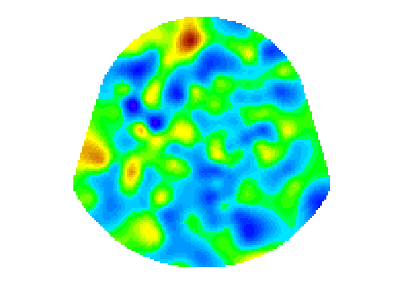

<!-- README.md is generated from README.Rmd. Please edit that file -->

# diegr

<!-- badges: start -->
<!-- badges: end -->

The name diegr comes from Dynamic and Interactive EEG Graphics using R.
The package is developed to display high-density electroencephalography
(HD-EEG) data in different ways using interactive elements or animations
for a comprehensive overview of data. The package diegr includes: -
interactive boxplots - interactive epoch waveforms - topographic maps
(2D projection) - head plots in 3D

## Installation

You can install the development version of diegr from
[GitHub](https://github.com/) with:

``` r
# install.packages("devtools")
devtools::install_github("gerslovaz/diegr")
```

## Example

This is a basic example which shows you how to plot interactive epoch
boxplots in different time points for one subject:

``` r
library(diegr)
#> Warning: replacing previous import 'ggplot2::last_plot' by 'plotly::last_plot'
#> when loading 'diegr'
```

``` r
data(epochdata)
boxplot_epoch(epochdata, subject = 1, channel = "E3", time_lim = c(260:270))
```

<div class="plotly html-widget html-fill-item" id="htmlwidget-2c4e965a5b8d7fa386b6" style="width:100%;height:480px;"></div>
<script type="application/json" data-for="htmlwidget-2c4e965a5b8d7fa386b6">{"x":{"visdat":{"51f875ca3332":["function () ","plotlyVisDat"]},"cur_data":"51f875ca3332","attrs":{"51f875ca3332":{"x":{},"y":{},"alpha_stroke":1,"sizes":[10,100],"spans":[1,20],"type":"box","hovertext":["Trial : 1","Trial : 1","Trial : 1","Trial : 1","Trial : 1","Trial : 1","Trial : 1","Trial : 1","Trial : 1","Trial : 1","Trial : 1","Trial : 5","Trial : 5","Trial : 5","Trial : 5","Trial : 5","Trial : 5","Trial : 5","Trial : 5","Trial : 5","Trial : 5","Trial : 5","Trial : 10","Trial : 10","Trial : 10","Trial : 10","Trial : 10","Trial : 10","Trial : 10","Trial : 10","Trial : 10","Trial : 10","Trial : 10","Trial : 13","Trial : 13","Trial : 13","Trial : 13","Trial : 13","Trial : 13","Trial : 13","Trial : 13","Trial : 13","Trial : 13","Trial : 13","Trial : 16","Trial : 16","Trial : 16","Trial : 16","Trial : 16","Trial : 16","Trial : 16","Trial : 16","Trial : 16","Trial : 16","Trial : 16","Trial : 22","Trial : 22","Trial : 22","Trial : 22","Trial : 22","Trial : 22","Trial : 22","Trial : 22","Trial : 22","Trial : 22","Trial : 22","Trial : 25","Trial : 25","Trial : 25","Trial : 25","Trial : 25","Trial : 25","Trial : 25","Trial : 25","Trial : 25","Trial : 25","Trial : 25","Trial : 28","Trial : 28","Trial : 28","Trial : 28","Trial : 28","Trial : 28","Trial : 28","Trial : 28","Trial : 28","Trial : 28","Trial : 28","Trial : 34","Trial : 34","Trial : 34","Trial : 34","Trial : 34","Trial : 34","Trial : 34","Trial : 34","Trial : 34","Trial : 34","Trial : 34","Trial : 36","Trial : 36","Trial : 36","Trial : 36","Trial : 36","Trial : 36","Trial : 36","Trial : 36","Trial : 36","Trial : 36","Trial : 36","Trial : 39","Trial : 39","Trial : 39","Trial : 39","Trial : 39","Trial : 39","Trial : 39","Trial : 39","Trial : 39","Trial : 39","Trial : 39","Trial : 41","Trial : 41","Trial : 41","Trial : 41","Trial : 41","Trial : 41","Trial : 41","Trial : 41","Trial : 41","Trial : 41","Trial : 41","Trial : 44","Trial : 44","Trial : 44","Trial : 44","Trial : 44","Trial : 44","Trial : 44","Trial : 44","Trial : 44","Trial : 44","Trial : 44","Trial : 47","Trial : 47","Trial : 47","Trial : 47","Trial : 47","Trial : 47","Trial : 47","Trial : 47","Trial : 47","Trial : 47","Trial : 47","Trial : 48","Trial : 48","Trial : 48","Trial : 48","Trial : 48","Trial : 48","Trial : 48","Trial : 48","Trial : 48","Trial : 48","Trial : 48"],"inherit":true}},"layout":{"margin":{"b":40,"l":60,"t":25,"r":10},"xaxis":{"domain":[0,1],"automargin":true,"title":"Time point"},"yaxis":{"domain":[0,1],"automargin":true,"title":"$\\mu V$"},"hovermode":"closest","showlegend":false},"source":"A","config":{"modeBarButtonsToAdd":["hoverclosest","hovercompare"],"showSendToCloud":false},"data":[{"fillcolor":"rgba(31,119,180,0.5)","x":[260,261,262,263,264,265,266,267,268,269,270,260,261,262,263,264,265,266,267,268,269,270,260,261,262,263,264,265,266,267,268,269,270,260,261,262,263,264,265,266,267,268,269,270,260,261,262,263,264,265,266,267,268,269,270,260,261,262,263,264,265,266,267,268,269,270,260,261,262,263,264,265,266,267,268,269,270,260,261,262,263,264,265,266,267,268,269,270,260,261,262,263,264,265,266,267,268,269,270,260,261,262,263,264,265,266,267,268,269,270,260,261,262,263,264,265,266,267,268,269,270,260,261,262,263,264,265,266,267,268,269,270,260,261,262,263,264,265,266,267,268,269,270,260,261,262,263,264,265,266,267,268,269,270,260,261,262,263,264,265,266,267,268,269,270],"y":[6.7505931854248047,20.761587142944336,12.101946830749512,10.646182060241699,9.7248420715332031,-2.4990794658660889,12.412166595458984,39.107147216796875,-1.7637187242507935,-0.41163069009780884,-3.6061038970947266,14.962586402893066,23.855300903320312,30.440101623535156,32.418632507324219,30.838302612304688,40.044406890869141,16.509662628173828,9.3404626846313477,13.420071601867676,8.962554931640625,17.553106307983398,10.524017333984375,26.268692016601562,38.744422912597656,20.254777908325195,17.087347030639648,27.388008117675781,37.58587646484375,30.142976760864258,19.466663360595703,30.803619384765625,24.989593505859375,-43.721134185791016,-42.634296417236328,-43.337791442871094,-36.290908813476562,-16.864116668701172,-16.725822448730469,-29.126565933227539,-25.74199104309082,-28.566207885742188,-36.692398071289062,-26.608907699584961,12.83400821685791,26.126789093017578,16.089412689208984,-0.31600481271743774,-3.0506172180175781,-5.2587013244628906,-14.82582950592041,-5.1802630424499512,11.138437271118164,16.538259506225586,28.177545547485352,12.034271240234375,15.507512092590332,22.830753326416016,14.773577690124512,9.1651735305786133,30.409549713134766,36.556953430175781,41.714599609375,58.074333190917969,39.602470397949219,9.0409479141235352,-5.104008674621582,-0.17843924462795258,11.400704383850098,13.546381950378418,-7.0182023048400879,-8.6177663803100586,1.3205662965774536,0.086399272084236145,-10.263596534729004,-7.2680263519287109,13.223785400390625,2.9879748821258545,5.7372784614562988,0.76592171192169189,9.7474126815795898,-0.69970744848251343,-36.523368835449219,-25.330780029296875,12.632840156555176,11.738457679748535,-19.626041412353516,-16.993532180786133,33.827583312988281,35.413078308105469,24.919244766235352,23.37653923034668,18.162364959716797,8.503270149230957,26.475858688354492,32.053050994873047,2.2349104881286621,-12.396758079528809,11.301413536071777,68.973686218261719,49.350051879882812,46.845474243164062,41.177562713623047,30.469646453857422,45.074062347412109,47.689933776855469,46.455646514892578,46.330005645751953,40.602447509765625,33.328521728515625,7.7364778518676758,0.34991607069969177,4.8208036422729492,7.2204990386962891,-12.962773323059082,-20.344369888305664,4.6984782218933105,24.196130752563477,12.667140007019043,6.1454100608825684,6.2865667343139648,3.6666390895843506,-0.22501355409622192,-8.5060338973999023,-14.518171310424805,-16.755170822143555,-6.29254150390625,14.392278671264648,26.674612045288086,25.523021697998047,21.986162185668945,0.24289634823799133,18.532329559326172,15.915426254272461,15.545402526855469,24.503828048706055,0.88637346029281616,-1.4421752691268921,14.845343589782715,11.645017623901367,12.006476402282715,9.7751684188842773,2.070361852645874,-129.06948852539062,-150.72694396972656,-141.49342346191406,-139.5411376953125,-160.94674682617188,-171.4967041015625,-146.69683837890625,-131.33314514160156,-139.50955200195312,-145.94136047363281,-146.46815490722656,732.8370361328125,726.891357421875,723.50274658203125,728.81427001953125,736.2659912109375,741.82122802734375,741.34527587890625,707.141357421875,712.10406494140625,726.0933837890625,724.4510498046875],"type":"box","hovertext":["Trial : 1","Trial : 1","Trial : 1","Trial : 1","Trial : 1","Trial : 1","Trial : 1","Trial : 1","Trial : 1","Trial : 1","Trial : 1","Trial : 5","Trial : 5","Trial : 5","Trial : 5","Trial : 5","Trial : 5","Trial : 5","Trial : 5","Trial : 5","Trial : 5","Trial : 5","Trial : 10","Trial : 10","Trial : 10","Trial : 10","Trial : 10","Trial : 10","Trial : 10","Trial : 10","Trial : 10","Trial : 10","Trial : 10","Trial : 13","Trial : 13","Trial : 13","Trial : 13","Trial : 13","Trial : 13","Trial : 13","Trial : 13","Trial : 13","Trial : 13","Trial : 13","Trial : 16","Trial : 16","Trial : 16","Trial : 16","Trial : 16","Trial : 16","Trial : 16","Trial : 16","Trial : 16","Trial : 16","Trial : 16","Trial : 22","Trial : 22","Trial : 22","Trial : 22","Trial : 22","Trial : 22","Trial : 22","Trial : 22","Trial : 22","Trial : 22","Trial : 22","Trial : 25","Trial : 25","Trial : 25","Trial : 25","Trial : 25","Trial : 25","Trial : 25","Trial : 25","Trial : 25","Trial : 25","Trial : 25","Trial : 28","Trial : 28","Trial : 28","Trial : 28","Trial : 28","Trial : 28","Trial : 28","Trial : 28","Trial : 28","Trial : 28","Trial : 28","Trial : 34","Trial : 34","Trial : 34","Trial : 34","Trial : 34","Trial : 34","Trial : 34","Trial : 34","Trial : 34","Trial : 34","Trial : 34","Trial : 36","Trial : 36","Trial : 36","Trial : 36","Trial : 36","Trial : 36","Trial : 36","Trial : 36","Trial : 36","Trial : 36","Trial : 36","Trial : 39","Trial : 39","Trial : 39","Trial : 39","Trial : 39","Trial : 39","Trial : 39","Trial : 39","Trial : 39","Trial : 39","Trial : 39","Trial : 41","Trial : 41","Trial : 41","Trial : 41","Trial : 41","Trial : 41","Trial : 41","Trial : 41","Trial : 41","Trial : 41","Trial : 41","Trial : 44","Trial : 44","Trial : 44","Trial : 44","Trial : 44","Trial : 44","Trial : 44","Trial : 44","Trial : 44","Trial : 44","Trial : 44","Trial : 47","Trial : 47","Trial : 47","Trial : 47","Trial : 47","Trial : 47","Trial : 47","Trial : 47","Trial : 47","Trial : 47","Trial : 47","Trial : 48","Trial : 48","Trial : 48","Trial : 48","Trial : 48","Trial : 48","Trial : 48","Trial : 48","Trial : 48","Trial : 48","Trial : 48"],"marker":{"color":"rgba(31,119,180,1)","line":{"color":"rgba(31,119,180,1)"}},"line":{"color":"rgba(31,119,180,1)"},"xaxis":"x","yaxis":"y","frame":null}],"highlight":{"on":"plotly_click","persistent":false,"dynamic":false,"selectize":false,"opacityDim":0.20000000000000001,"selected":{"opacity":1},"debounce":0},"shinyEvents":["plotly_hover","plotly_click","plotly_selected","plotly_relayout","plotly_brushed","plotly_brushing","plotly_clickannotation","plotly_doubleclick","plotly_deselect","plotly_afterplot","plotly_sunburstclick"],"base_url":"https://plot.ly"},"evals":[],"jsHooks":[]}</script>
<!-- What is special about using `README.Rmd` instead of just `README.md`? You can include R chunks like so: -->

``` r
data("HCGSN256")
M1 <- point_mesh(2, type = "polygon")
signal <- epochdata |>
  dplyr::filter(subject == 1 & epoch == 10 & time == 255) 
signal <- signal$signal
topo_plot(signal, M1)
```



<!-- You'll still need to render `README.Rmd` regularly, to keep `README.md` up-to-date. `devtools::build_readme()` is handy for this. -->
<!-- You can also embed plots, for example: -->
<!-- ```{r pressure, echo = FALSE} -->
<!-- plot(pressure) -->
<!-- ``` -->
<!-- In that case, don't forget to commit and push the resulting figure files, so they display on GitHub and CRAN. -->
