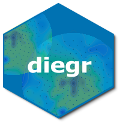
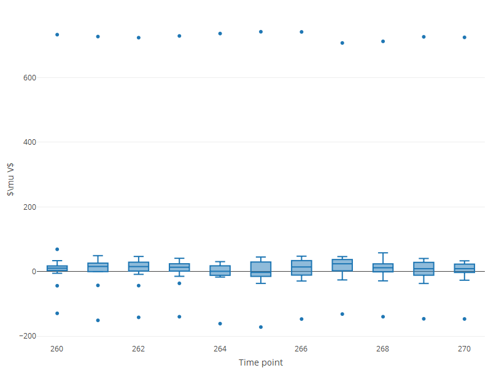
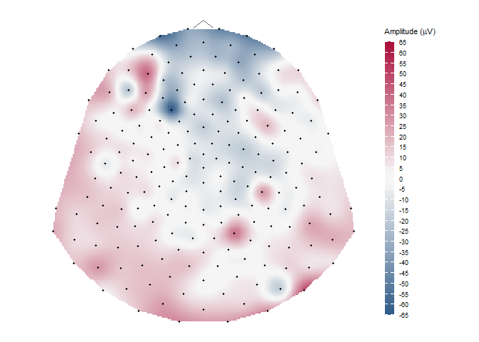
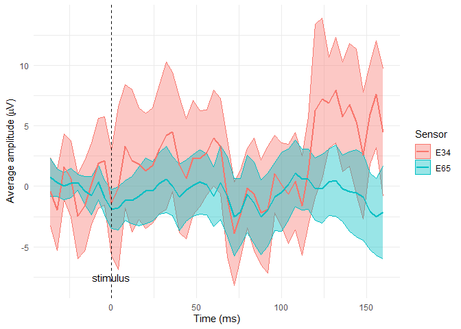

<!-- README.md is generated from README.Rmd. Please edit that file -->

# diegr: Dynamic and Interactive EEG Graphics 

<!-- badges: start -->

[](https://cran.r-project.org/package=diegr)
[](https://cran.r-project.org/package=diegr)

<!-- badges: end -->

**Overview**

The `diegr` package enables researchers to visualize high-density
electroencephalography (HD-EEG) data with animated and interactive
graphics, supporting both exploratory and confirmatory analyses of
sensor-level brain signals.

The package `diegr` includes:

- interactive boxplots (`boxplot_epoch()`, `boxplot_subject()`,
  `boxplot_rt()`)
- interactive waveforms (`interactive_waveforms()`) and surface plots
  (`interactive_surfaceplot()`, `interactive_surfaceplot_curves()`)
- topographic maps in 2D (`topo_plot()`)
- scalp plots in 3D (`scalp_plot()`)
- functions for computing summary statistics, baseline correction,
  pointwise and jackknife means (`summary_stats_rt()`,
  `baseline_correction()`, `compute_mean()`)
- functions for easy selection of data subsets or regions of interest
  (`pick_data()`, `pick_region()`)
- functions for plotting the mean with pointwise confidence intervals
  (`plot_time_mean()`, `plot_topo_mean()`)
- animations of the time course of raw signals or averages in 2D and 3D
  (`animate_topo()`, `animate_topo_mean()`, `animate_scalp()`)

## Installation

You can install the current version of `diegr` from CRAN with:

``` r
install.packages("diegr")
```

or the latest development version from GitHub with:

``` r
# install.packages("pak")
pak::pak("gerslovaz/diegr") 
```

## Data

Due to the large volumes of data obtained from HD-EEG measurements, the
package allows users to work directly with database tables (in addition
to common formats such as data frames or tibbles). This approach is much
more memory-efficient.

The database you want to use as input to `diegr` functions must contain
columns with the following structure:

- `group` - group IDs,
- `subject` - subject IDs,
- `sensor` - sensor labels,
- `epoch` - epoch numbers,
- `condition` - experimental condition labels,
- `time` - time-point indices (as sampling indices, not in ms),
- `signal` - the EEG signal amplitude in microvolts (in most functions,
  the name of the column containing the amplitude can be customized
  arbitrarily).

Note: It is not necessary for the data to contain all variables, but if
it does, they must be named according to the structure presented above.
You can use the `check_structure()` function, which checks the data
structure and prints the inferred hierarchy.

The package includes several example datasets:

- `epochdata`: epoched HD-EEG data (anonymized small subset of a large
  HD-EEG study presented in Madetko-Alster et al., 2025) for two
  subjects and 204 selected sensors at 50 time points (measured using
  the EGI HCGSN256 system),
- `rtdata`: response times (time between stimulus presentation and a
  button press) from the experiment involving a simple visual motor task
  (anonymized small subset of a large HD-EEG study presented in
  Madetko-Alster et al., 2025)

as well as datasets containing sensor position coordinates:

- `HCGSN256`: a list with Cartesian coordinates of HD-EEG sensor
  positions in 3D space on the scalp surface and their projection into
  2D space according to the EGI HCGSN256 template,
- `biosemi128` and `biosemi256`: lists with Cartesian coordinates of
  HD-EEG sensor positions in 3D space on the scalp surface and their
  projection into 2D space according to the BioSemi system with 128 and
  256 electrodes,
- `system1005`: a list with Cartesian coordinates of HD-EEG sensor
  positions in 3D space on the scalp surface and their projection into
  2D space according to the standard 10-05 system.

For more information about the structure of the built-in data, see the
package vignette `vignette("diegr", package = "diegr")`.

## Quick examples

#### Interactive boxplot

This basic example shows how to plot interactive epoch boxplots from a
chosen electrode at different time points for one subject:

``` r
library(diegr)
data("epochdata")
```

``` r
epochdata |>
  pick_data(subject_rg = 1, sensor_rg = "E65") |>
  boxplot_epoch(amplitude = "signal", time_lim = 10:20)
```



Note: The README format does not support interactive `plotly` elements,
therefore, only a static preview of the result is shown.

#### Topographic map

``` r
data("HCGSN256")
# creating a mesh
M1 <- point_mesh(dimension = 2, n = 30000, type = "polygon",
                 template = "HCGSN256", 
                 sensor_select = unique(epochdata$sensor))
# filtering a subset of data to display 
data_short <- epochdata |>
  pick_data(subject_rg = 1, time_rg = 15, epoch_rg = 10)
# or you can use dplyr::filter()
# dplyr::filter(subject == 1 & epoch == 10 & time == 15) 
# function for displaying a topographic map of the chosen signal on the created mesh M1
topo_plot(data_short, amplitude = "signal", mesh = M1)
```



#### Computing and displaying the average in the time domain

Compute the average signal for subject 2 from channels E65 and E34
(excluding the outlier epochs 14 and 15) and then display it along with
confidence interval (CI) bounds (using `plot_time_mean()` conditioned by
sensor).

``` r
# extract required data
edata <- epochdata |>
  pick_data(subject_rg = 2, sensor_rg = c("E34", "E65"), epoch_rg = 1:13)
# baseline correction
data_base <- baseline_correction(edata, baseline_range = 1:9)
# compute average
data_mean <- data_base |> 
  compute_mean(amplitude = "signal_base", type = "point", domain = "time")
# plot the average line with CI
plot_time_mean(data = data_mean, t0 = 10, condition_column = "sensor", legend_title = "Sensor")
```



For detailed examples, usage instructions, and troubleshooting
information, including system requirements, see the package vignette:
`vignette("diegr", package = "diegr")`.

**References** Madetko-Alster N., Alster P., Lamoš M., Šmahovská L.,
Boušek T., Rektor I. and Bočková M. The role of the somatosensory cortex
in self-paced movement impairment in Parkinson’s disease. *Clinical
Neurophysiology.* 2025, vol. 171, 11-17.
<https://doi.org/10.1016/j.clinph.2025.01.001>

**License** This package is distributed under the MIT license. See the
LICENSE file for details.

**Citation** Use `citation("diegr")` to cite this package.

<!-- You'll still need to render `README.Rmd` regularly, to keep `README.md` up-to-date. `devtools::build_readme()` is handy for this. -->

<!-- You can also embed plots, for example: -->

<!-- ```{r pressure, echo = FALSE} -->

<!-- plot(pressure) -->

<!-- ``` -->

<!-- In that case, don't forget to commit and push the resulting figure files, so they display on GitHub and CRAN. -->
