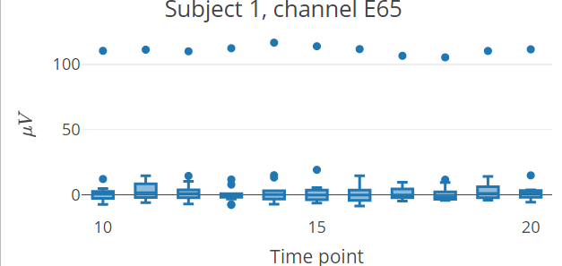

<!-- README.md is generated from README.Rmd. Please edit that file -->

# diegr

<!-- badges: start -->
<!-- badges: end -->

The name diegr comes from Dynamic and Interactive EEG Graphics using R.
The package is developed to display high-density electroencephalography
(HD-EEG) data in different ways using interactive elements or animations
for a comprehensive overview of data. The package diegr includes: -
interactive boxplots - interactive epoch waveforms - topographic maps
(2D projection) - head plots in 3D

## Installation

You can install the development version of diegr from
[GitHub](https://github.com/) with:

``` r
# install.packages("devtools")
devtools::install_github("gerslovaz/diegr")
```

## Example

This is a basic example which shows you how to plot interactive epoch
boxplots in different time points for one subject:

``` r
library(diegr)
#> Warning: replacing previous import 'ggplot2::last_plot' by 'plotly::last_plot'
#> when loading 'diegr'
```

``` r
data(epochdata)
p <- boxplot_epoch(epochdata, subject = 1, channel = "E3", time_lim = c(260:270))
saveWidget(p, "./man/figures/README-boxplot.html", selfcontained = TRUE)

# Konverze HTML souboru na PNG obrázek
webshot("./man/figures/README-boxplot.html", file = "./man/figures/README-boxplot.png", vwidth = 800, vheight = 600, delay = 0.2)
```


``` r

# Vložení PNG obrázku do R Markdown dokumentu

```


<!-- What is special about using `README.Rmd` instead of just `README.md`? You can include R chunks like so: -->

``` r
data("HCGSN256")
M1 <- point_mesh(2, type = "polygon")
signal <- epochdata |>
  dplyr::filter(subject == 1 & epoch == 10 & time == 255) 
signal <- signal$signal
topo_plot(signal, M1)
```


<!-- You'll still need to render `README.Rmd` regularly, to keep `README.md` up-to-date. `devtools::build_readme()` is handy for this. -->
<!-- You can also embed plots, for example: -->
<!-- ```{r pressure, echo = FALSE} -->
<!-- plot(pressure) -->
<!-- ``` -->
<!-- In that case, don't forget to commit and push the resulting figure files, so they display on GitHub and CRAN. -->
