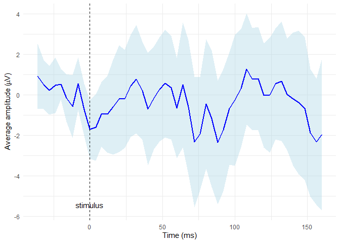

<!-- README.md is generated from README.Rmd. Please edit that file -->

# diegr

<!-- badges: start -->

<!-- badges: end -->

## Overview

The name diegr comes from **Dynamic and Interactive EEG Graphics using
R**. The package is developed to display high-density
electroencephalography (HD-EEG) data in different ways using interactive
elements or animations for a comprehensive overview of data.

The package `diegr` includes:

- interactive boxplots
- interactive epoch waveforms
- topographic maps (2D projection)
- head plots in 3D
- functions for computing baseline correction, pointwise and jackknife
  mean
- functions for plotting the mean with pointwise confidence interval
- animations of time course of the raw signal or the average in 2D and
  3D

## Installation

``` r
install.packages("diegr")
# devtools::install_github("gerslovaz/diegr") development version will be available later
```

## Data

Because of large volumes of data obtained from HD-EEG measurements, the
package allows users to work directly with database tables (in addition
to common formats such as data frames or tibbles). Such a procedure is
more efficient in terms of memory usage.

The database you want to use as input to `diegr` functions must contain
columns with the following names:

- `subject` - ID of subjects,
- `epoch` - epoch numbers
- `time` - numbers of time points (as sampling points, not in ms),
- `sensor` - sensor labels,
- `signal` - the EEG signal amplitude in microvolts (in some functions
  it is possible to set the name of the column containing the amplitude
  arbitrarily).

The package contains some included training datasets:

- `epochdata`: epoched HD-EEG data (short slice from big HD-EEG study)
  arranged as mentioned above,
- `HCGSN256`: a list with Cartesian coordinates of HD-EEG sensor
  positions in 3D space on the scalp surface and their projection into
  2D space
- `rtdata`: response times (time between stimulus presentation and
  pressing the button) from the experiment involving a simple visual
  motor task.

For more information about the structure of built-in data and conversion
from Matlab hdf5 files to database tables using R see [the diegr
vignette](doc/diegr.html).

## Examples of graphic functions

#### Interactive boxplot

This is a basic example which shows how to plot interactive epoch
boxplots from chosen electrode in different time points for one subject:

``` r
library(diegr)
data("epochdata")
```

``` r
boxplot_epoch(epochdata, subject = 1, channel = "E3", time_lim = c(260:270))
```


Note: The README format does not allow the inclusion of `plotly`
interactive elements, only the static preview of the result is shown.

#### Topographic map

``` r
data("HCGSN256")
# creating a mesh
M1 <- point_mesh(dim = 2, n = 30000, type = "polygon")
# filtering a subset of data to display 
data_short <- epochdata |>
  dplyr::filter(subject == 1 & epoch == 10 & time == 15) 
# function for displaying a topographic map of the chosen signal on the created mesh M1
topo_plot(data_short, amplitude = "signal", mesh = M1)
```


## Computing and displaying the average

Compute the average signal for subject 2 from the channel E65 (exclude
the oulier epochs 14 and 15) and then display it along with CI bounds

``` r
# extract required data
edata <- epochdata |>
dplyr::filter(subject == 2 & sensor == "E65" & epoch %in% 1:13)
# baseline correction
data_base <- baseline_correction(edata, base_int = 1:10)
# compute average
data_mean <- compute_mean(data_base, amplitude = "signal_base", subject = 2, channel = "E65", type = "point")
# plot the average line with CI in blue colors
plot_time_mean(data = data_mean, t0 = 10, color = "blue", fill = "lightblue")
```



For more examples and basic informations about using the package see
[the diegr vignette](doc/diegr.html).

<!-- You'll still need to render `README.Rmd` regularly, to keep `README.md` up-to-date. `devtools::build_readme()` is handy for this. -->

<!-- You can also embed plots, for example: -->

<!-- ```{r pressure, echo = FALSE} -->

<!-- plot(pressure) -->

<!-- ``` -->

<!-- In that case, don't forget to commit and push the resulting figure files, so they display on GitHub and CRAN. -->
