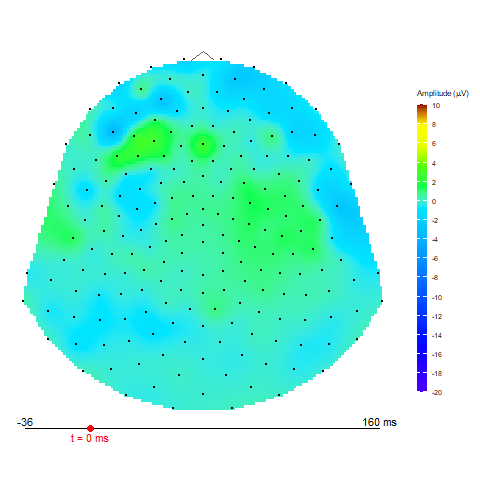
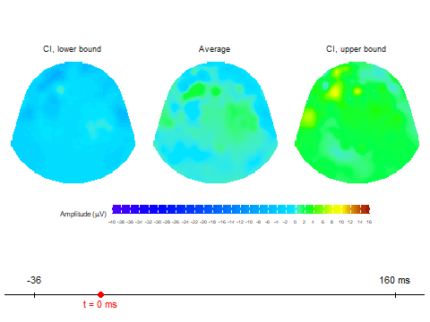

```{r, include = FALSE}
knitr::opts_chunk$set(
  collapse = TRUE,
  comment = "#>",
  dev = "png"
)
options(
  gganimate.renderer = gganimate::gifski_renderer(),
  bitmapType = "cairo"
)
```

```{r setup}
#| echo: false
#| message: false
library(diegr)
library(dplyr)
library(gganimate)
library(gifski)
```

This article introduces how to create animated HD-EEG topographic maps using the `diegr` package. We will demonstrate how to visualize changes in EEG amplitude over time using built-in animation functions.

## Topographic map animations in 2D

To display changes in EEG amplitude over time as an animated 2D topographic map, the `diegr` package provides two main functions:

- `animate_topo`
Creates basic animated topographic map of a selected variable. The input can be raw EEG signal, averaged signal, or any other amplitude column in the input data frame.

- `animate_topo_mean`
Designed specifically for data frames produced by the `compute_mean` function. In addition to the average signal, this function also visualizes the lower and upper confidence interval bounds.

## Example: Animating EEG amplitude after stimulus

In this example, we want to examine the development of EEG amplitude for one subject within a 100 ms time window after stimulus onset.

Data used in this example are built-in dataset `epochdata`, we select Subject 1 and the time interval 10 (stimulus onset) to 35 (100 ms after stimulus).

### Step 1 -- Filtering and cleaning the data

In this example, we will start by inspecting the raw epoched data for potential outliers; we want to identify and remove extreme values before proceeding with further analyses.

For this purpose, we examine response times and amplitude values (for an individual sensor within a selected time range) using interactive boxplots. 

```{r}
#| echo: true
#| eval: true
# load datasets
data("epochdata")
data("rtdata")
# boxplots of response times
boxplot_rt(rtdata)
# filter subject 1
subject01 <- pick_data(epochdata, subject_rg = 1)
# boxplots of amplitude for sensor E152
pick_data(subject01, sensor_rg = "E152") |>
  boxplot_epoch(amplitude = "signal", time_lim = 10:20)
```

From the boxplots, we identify:
- epoch 1 as an outlier in response times 
- epoch 14 as an outlier in amplitude.
These two epoch should be excluded before further computation. 

```{r}
#| echo: true
# extract outlier epochs
subject01_clean <- pick_data(subject01, epoch_rg = 2:13)
```

At this point, `subject01_clean` contains data for Subject 1 with the identified outlier epochs removed and is ready for subsequent analysis steps. 

### Step 2 - Baseline correction and averaging

Once outliers have been excluded, we need to normalize the signal. This is done using the `baseline_correction` function, where we specify the time range to be used as a reference.

After baseline correction we compute the mean amplitudes for the time window of interest (10 to 35 time points).

```{r}
# baseline correction
subject01_base <- baseline_correction(subject01_clean, baseline_range = 1:10)
# compute average for selected times
subject01_mean <- subject01_base |>
  pick_data(time_rg = 10:35) |>
  compute_mean(amplitude = "signal_base", domain = "space",
               level = "epoch", type = "jack")
```

At this point, `subject01_mean` contains averaged data for Subject 1 within the selected time window and is ready for animations. 

### Step 3 -- Animation

To provide a clear overview, the animations include a timeline with a marker indicating the current time. Using the `t0` and `t_lim` arguments, we can define both the "zero point" of the animation (e.g., stimulus onset) and the total range of the axis.  *Note: Both arguments must be entered as time point indices, not in miliseconds (e.g., use `t0 = 10` instead of `t0 = 0ms`).*

In addition to rendering within the R viewer, functions also enable saving animations in `gif` format to a chosen location.

In this example, we set:
`t0 = 10` -- stimulus onset is at time point 10  
`t_lim = c(1,50)` -- the whole time interval presented in the `epochdata`  
`FS = 250` -- sampling frequency is 250 Hz (i.e. there is interval 4 ms between two time points)
`template = "HCGSN256"` -- we want plot according to the HCGSN256 template, dense point mesh is constructed automatically inside the function

**Animation via `animate_topo` function**

```{r, eval=FALSE}
animate_topo(subject01_mean, amplitude = "average",
             t_lim = c(1,50), t0 = 10, FS = 250,
             template = "HCGSN256")
```

```{r, echo=FALSE}

```


**Animation via `animate_topo_mean` function**

```{r, eval=FALSE}
animate_topo_mean(subject01_mean, 
             t_lim = c(1,50), t0 = 10, FS = 250,
             template = "HCGSN256")
```

```{r, echo=FALSE}

```

